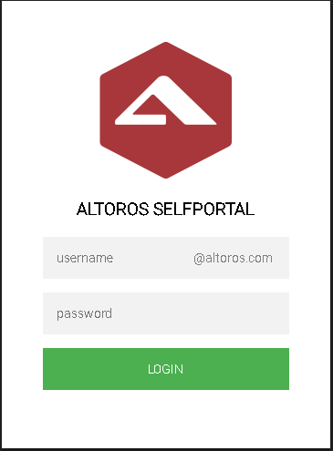
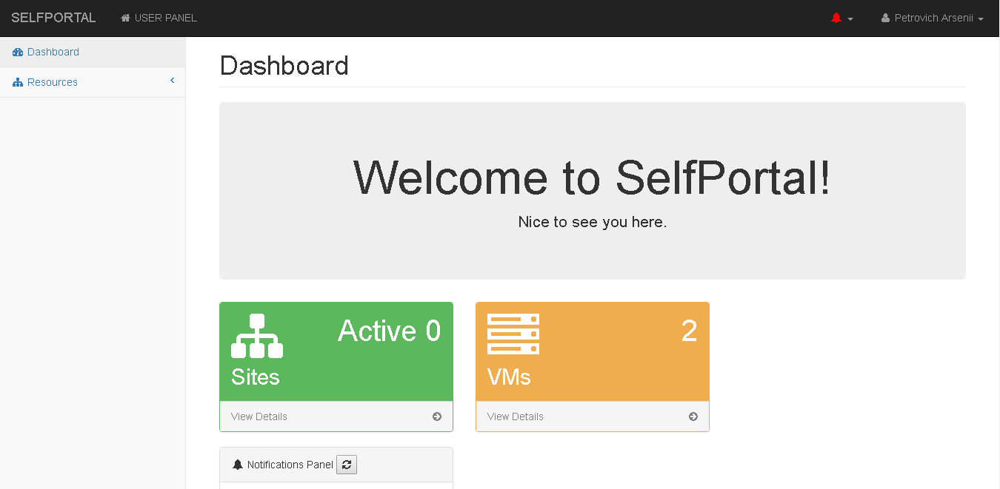
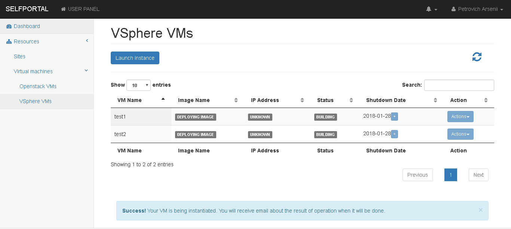
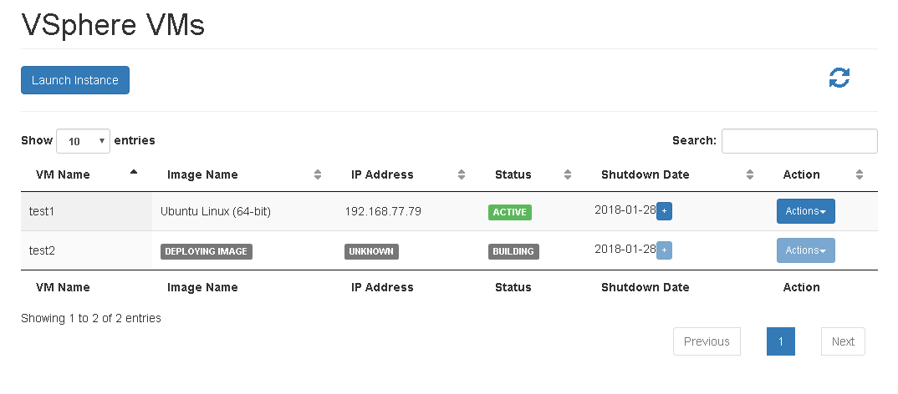
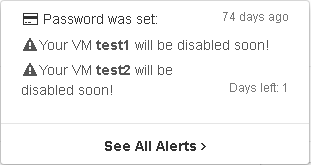

<p align="center">
  
</p>

# About

SelfPortal is a service, that was created by an Altoros DevOps team in order to resolve problem with granting access to company resources for developers. It's started as a small, almost static web page, that helped developers to publish their websites into the global network, but over time became a utility, that provide 

## Getting Started

These instructions will get you a copy of the project up and running on your local machine for development and testing purposes. See deployment for notes on how to deploy the project on a live system.

### Prerequisites

In order to get SelfPortal properly functional you need to have OpenStack and VSphere (VCenter) installations in your infrastructure and a Ubuntu Linux machine.
At both installations you should have prepared Images (OpenStack) or Templates (VSphere).

### Installing

1. Install NGINX, PHP (curl, json, ldap, mysqli, xml modules), MySQL/MariaDB, Perl (JSON, YAML, LWP::Protocol::https, Socket6, Switch, IO::Socket::SSL modules).
```Shell
sudo -i
apt install nginx php php-curl php-json php-ldap php-mysqli php-xml -y
apt install mysql-server
apt install make gcc libssl-dev
cpan install CPAN
cpan reload cpan
cpan install JSON
cpan install YAML
cpan install LWP::Protocol::https
cpan install IO::Socket::SSL
cpan install Switch
cpan install Socket6
```
> Do not hesitate to use php -m to verify and check all php libraries installed.

2. Create /var/log/selfportal folder, grant writing access to www-data and setup logrotate for /var/log/selfportal.log file as well.

3. Clone this repo to /var/www/selfportal. Import database from /var/www/selfportal/master/db/portal.sql

4. Install VMWare vSphere Perl SDK (download it from vmware.com. [Here](https://code.vmware.com/web/sdk/60/vsphere-perl) is a link for VSphere 6.0 SDK).

> Prerequisites: 
```Shell
sudo apt-get install lib32z1 build-essential gcc uuid uuid-dev perl libssl-dev perl-doc liburi-perl libxml-libxml-perl libcrypt-ssleay-perl
```

Extract the archive you've downloaded from VMWare website. Install SDK executng vmware-install.pl file.
```Shell
sudo vmware-vsphere-cli-distrib/vmware-install.pl
```

> There are two common issues in the installation proccess:
1. While executing vmware-install.pl file you will be prompted to install required dependencies. When you will agree to do this - each dependency will be install for 1-2 minutes. But one of them, called Soap::Lite will be installed. Нажать Ctrl+C один раз.

2. Perl will throw warnings, until you change one line at /usr/share/perl/<version>/VMware/VICommon.pm, where <version> is a version of your Perl. For 6.0 - it was a line #2332.

Original line:
```Perl 
return defined $user_agent->cookie_jar and $user_agent->cookie_jar->as_string ne '';
```
Line to replace:
```Perl
return (defined $user_agent->cookie_jar and $user_agent->cookie_jar->as_string ne ''); 
```

5. Install Python OpenStack client. Go to https://pypi.python.org/pypi/python-openstackclient for details.
```Shell
sudo -i
apt install python-pip
pip install python-openstackclient
```

6. Setup nginx to display selfportal at /var/www/selfportal. It's better to use https, you know it.

7. Rename /var/www/selfportal/config/config.php.example to /var/www/selfportal/config/config.php, change all values in accordance to your infrastruscture settings.

8. Copy config/sites-enabled/proxy.conf to /etc/nginx/sites-enabled/proxy.conf. Setup writing access for www-data.

10. Use sudo visudo command to add line to sudouers file:

> www-data    ALL=NOPASSWD: /usr/sbin/nginx, /usr/bin/crontab, /bin/grep

## Testing and using

Once deployed, you can open SelfPortal at your web browser. The login window will appear:



But do not hurry to celebrate - it's just a static web page, that doesn't require even a database connection. Input your credentials and press "Login" button. If the following window appears without causing any problems, such as incessant page refreshing, you're probably installed everything correctly.



But, just to be sure, lets start some virtual machines:



> Warning! VSphere VM creation is asynchronous and OpenStack is not. This part of instruction is based on VSphere VM creation.

Just wait a little (VM creation time is really depends on multiple conditions, such as image size, host performance and so on), then press refresh icon at the top right corner of the page. If your VCenter shows, that VM is ready, but SelfPortal (within a time of one minute) it doesn't - you've probably forgot to add www-data permissions to modify root crontab.



That's it! Now you can check your notifications... 



...or go to admin panel and check the VMs of other users (if you have sufficient permissions, of course:wink:).


## Contributing

We are freely opened to any contributor, who wants to help us to improve our product.


## Authors

* **Alex Merguriev** - *Idea, initial development* - [Merguriev](https://github.com/merguriev)
* **Arsenii Petrovich** - *Initial&Further development, bug fixing* - [Petrovich](https://github.com/ArseniiPetrovich)

See also the list of [contributors](https://github.com/altoros/selfportal/contributors) who participated in this project.

## License

This project is licensed under the CC-BY-NC-SA License - see the [CC website](https://creativecommons.org/licenses/by-nc-sa/4.0/legalcode) for details

## Acknowledgments && Built-ins

* [VMWare code examples](https://github.com/vmware/vsphere-automation-sdk-perl) are widely used in this project.
* Great thanks to Vittorio Pavesi and hist [this](http://vittoriop77.blogspot.com.by/2016/03/vsphere-6-html-console.html) post particularly, which has guided us through creating VNC console for our portal.
* [VMWare](communities.vmware.com) and [OpenStack](https://www.openstack.org/community/) communities topics have helped us a lot.
* [PHPMailer](https://github.com/PHPMailer/PHPMailer) is used to notificate users and admins team.
* [Bootstrap](https://getbootstrap.com/) in concatenation with [Font Awesome Icons](http://fontawesome.io/) is a libraries we've based on. [SB Admin](https://startbootstrap.com/template-overviews/sb-admin-2/) - is a template we used.
* [jQuery](https://jquery.com/), [jQueryUI](https://jqueryui.com/), [MetisMenu](https://github.com/onokumus/metismenu), [DataTables](https://datatables.net/) - all of this is used to make picture beautiful for you. 

## Development plans

- [x] Acrhitecture&Interface
- [x] Splitting rights, admin panel
- [x] HTTP website proxy, blacklist
- [x] User list
- [x] OpenStack provider - VM creation, modification, deletion
- [x] VSphere provider - VM creation, modification, deletion
- [x] Terminator - delete old unused websites and VMs
- [ ] HTTPS website proxy using Lets Encrypt wildcard certificates
- [ ] WebSocket proxy
- [ ] VMs Backups/Snapshots
- [ ] Mounting ISO files to VSphere VMs